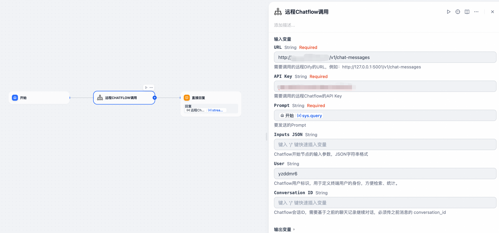

## Chatflow Invoker

**Author:** yzddmr6
**Version:** 0.0.4
**Type:** tool
**Repository:** https://github.com/yzddmr6/chatflow_invoker

### Changelog

#### v0.0.4

* Support error message display from nodes for easier troubleshooting
* Support non-streaming output mode, you can get streaming output through stream_output and non-streaming output through text field
* Fixed Conversation ID maintenance logic to support memory functionality in multi-turn conversations
* Added Universal Chatflow Invoker tool, supporting Agent calls for any streaming interface

#### v0.0.3

* Update dify_plugin dependency version

#### v0.0.2

* Added remote Chatflow calls
* Added Conversation ID parameter

#### v0.0.1

* Supported local cross-Chatflow calls

### Background

Currently, Dify does not support multi-Chatflow orchestration or cross-Chatflow invocation. This means that all business logic must be completed within a single Chatflow canvas, which becomes difficult to maintain as scenarios become more complex.

Although Dify provides a workaround by allowing Chatflows to be converted into Workflows and published as Tool nodes, this approach has the following limitations:

* **No support for streaming output:** When a Workflow is invoked as a Tool node, it does not support the original streaming output capability of Chatflow, which affects the user experience.
* **No support for multiple output nodes:** Unlike Chatflow, Workflow does not support multiple output nodes, further limiting data processing and presentation in complex business scenarios.

To address these limitations in multi-Chatflow orchestration, I have developed a plugin called Chatflow Invoker, which enables more flexible and efficient application development with Dify.

### Description

Chatflow Invoker can convert a Chatflow into a node within a process workflow, enabling cross-Chatflow invocation.

It can help you:

* **Achieve modularization of Chatflows:** Break down complex business logic into multiple independent Chatflows, improving code reusability and maintainability.
* **Support cross-Chatflow invocation:** Seamlessly call between different Chatflows to enable more flexible business process orchestration.
* **Maintain streaming output experience:** Ensure that Dify’s original streaming output capability is retained even in multi-Chatflow invocation scenarios.

### Local Chatflow Call

Through Dify's reverse invocation interface, you can reverse-call other Chatflows within the current Dify instance.


Input Parameters:

* App ID (required): The Chatflow app ID to be called. This can be obtained from the Chatflow page URL in Dify.
* Prompt (required): The prompt to be sent.
* Inputs JSON (optional): Input parameters for the Chatflow start node, in JSON string format.
* Keep Conversation (required, default True): Whether to maintain conversation context to support memory functionality.

### Remote Chatflow Call

To further expand Dify's flexibility, this plugin supports remote Chatflow calls. You're no longer limited to a single Dify instance; you can freely combine them to implement distributed calls based on your business needs.


Input Parameters:

* URL (required): The URL of the remote Dify call you want to make, for example: http://127.0.0.1/v1/chat-messages
* API Key (required): The API key for the remote Chatflow call you want to make. For the first time, you'll need to generate one from the Access API section in the sidebar.
* Prompt (required): The prompt to send.
* Inputs JSON (optional): Input parameters for the Chatflow start node, in JSON string format.
* User (optional): The Chatflow user ID, used to identify the end user for easy retrieval and statistics.
* Keep Conversation (required, default True): Whether to maintain conversation context to support memory functionality.

### Universal Chatflow Call

In large and complex projects, some Agents may be developed on different platforms such as LangChain, LangGraph, OpenAI, Bailian, etc. How can we achieve unified management and invocation in Dify?

If streaming output is not required, this can be achieved through HTTP calls or by publishing the Agent as an MCP tool, but this would sacrifice streaming output and affect user experience.

Therefore, I have implemented a universal streaming interface calling tool. Whether it's a model, Agent, Workflow, or Chatflow, regardless of which platform it was born on or which SDK it uses, as long as it provides a streaming output interface, it can easily integrate into Dify while **perfectly preserving streaming output capability**. Say goodbye to experience gaps and make your Dify applications more powerful and smooth.


Input Parameters:

* URL (required): The URL of the remote service to call, for example: http://localhost/v1/chat/completions
* Header JSON (optional): Request header information in JSON string format, for example: {"Authorization": "xxxx"}
* Body JSON (optional): Request body information in JSON string format, for example: {"model": "qwen-max", "messages": [{"role": "user", "content": "{{#sys.query#}}"}], "temperature": 0.7, "stream": true}
* JSON Path (required): JSON Path to extract return content from the response, following jsonpath_ng library syntax. For example, OpenAI-like interfaces: $.choices[0].delta.content; Bailian workflow applications: $.output.workflow_message.message.content

### Usage Examples

#### Calling Local Dify Chatflow

Open the URL of the Chatflow to be called and obtain the APP ID from it.

For example: https://dify/app/f011f58c-b1ce-4a9b-89b2-f39fce8466a8/workflow

Here, `f011f58c-b1ce-4a9b-89b2-f39fce8466a8` is the APP ID.

For the Inputs JSON, set it to receive a user parameter.


In the reply node, select `stream_output` to obtain streaming output results.


Upon testing, the other Chatflow is successfully invoked, and streaming output is supported.


#### Calling Remote Dify Chatflow via API

Fill in the URL to call and the API Key to implement remote Dify calls.



#### Maintaining Conversation Memory

Create a simple test (note that memory functionality must be enabled in the called Chatflow).

Set Keep Conversation to True, then conduct multiple conversations.


From the second response, you can see that the Chatflow has implemented contextual conversation memory functionality.


#### Dify Calling OpenAI Format Agent

I simulated an Agent developed with LangGraph and had Cursor help me implement an OpenAI format interface.

Fill in the Agent's API address. Here, no authentication logic is set and no modification is needed. Save and execute.


You can see that the LangGraph Agent has been successfully called with streaming output support.


#### Dify Calling Bailian Agent

Using Bailian as an example, let's show how to integrate a new output format Agent.

I developed a simple application on Bailian that accepts a query and a name parameter.


According to Bailian's documentation, we find the **streaming output** curl command: https://help.aliyun.com/zh/model-studio/invoke-workflow-application

```
curl --location 'https://dashscope.aliyuncs.com/api/v1/apps/YOUR_APP_ID/completion' \
--header 'X-DashScope-SSE: enable' \
--header 'Content-Type: application/json' \
--header 'Authorization: Bearer $DASHSCOPE_API_KEY' \
--data '{
    "input": {
        "prompt": "你是谁？"
    },
    "parameters":  {
        "flow_stream_mode": "message_format"
    },
    "debug": {}
}'
```

Construct the corresponding call parameters:

```
https://dashscope.aliyuncs.com/api/v1/apps/xxx/completion
{
    "Authorization": "Bearer sk-xxx",
    "X-DashScope-SSE": "enable"
}
{
    "input": {
        "prompt": "{{#sys.query#}}",
        "biz_params": {"name": "yzddmr6"}
    },
    "parameters": {
        "flow_stream_mode": "message_format"
    },
    "debug": {}
}
```

And get the corresponding response example, write the corresponding Json Path:

```
id:1
event:result
:HTTP_STATUS/200
data:{"output":{"session_id":"0a6aff53d8e945e4900452f04d55499b","workflow_message":{"node_status":"executing","node_type":"End","node_msg_seq_id":1,"node_name":"结束","message":{"content":"我是通义千问","role":"assistant"},"node_is_completed":false,"node_id":"End_7w1V"},"finish_reason":"null"},"usage":{},"request_id":"88878d48-097f-99c3-b6b9-b76f7366da90"}
```


Successfully call Bailian application and achieve streaming output.