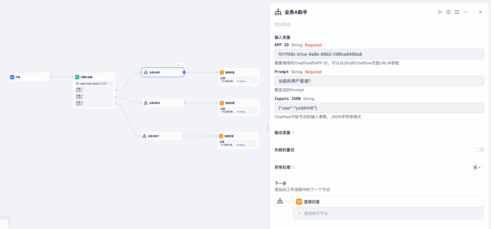

## Chatflow Invoker

**Author:** yzddmr6
**Version:** 0.0.1
**Type:** tool

### 背景

当前Dify并不支持多Chatflow编排和跨Chatflow的调用。这意味着所有业务逻辑都必须在一个Chatflow画布中完成，当场景变得复杂时，画布将变得难以维护。

尽管Dify提供了将Chatflow转换为Workflow，并发布为Tool节点这种变通的调用方案，但这种方法存在以下限制：

* **无法实现流式输出**：Workflow作为Tool节点调用时，不支持Chatflow原有的流式输出能力，影响用户体验。
* **无法实现多个输出节点**：Workflow不像Chatflow那样支持多输出节点，进一步限制了复杂业务场景下的数据处理和展示。

因此我开发了一款插件：Chatflow Invoker，可以解决Dify在多Chatflow编排上的限制，让应用开发更加灵活和高效。

### 描述

Chatflow Invoker可以将Chatflow转换为流程编排中的节点，实现跨Chatflow调用。

它可以帮助您：

* **实现Chatflow的模块化**：将复杂业务逻辑拆分为多个独立的Chatflow，提高代码复用性和可维护性。
* **支持跨Chatflow调用**：在不同的Chatflow之间无缝调用，实现更灵活的业务流程编排。
* **保持流式输出体验**：确保在多Chatflow调用场景下依然能够享受Dify原有的流式输出能力。

输入共有三个参数：

* APP ID（必选）：需要调用的Chatflow的APP ID，可以从Dify的Chatflow页面URL中获取。
* Prompt（必选）：要发送的Prompt。
* Inputs JSON（可选）：Chatflow开始节点的输入参数，JSON字符串格式。

### Example

这里模拟了一个简单的场景。

首先打开待调用Chatflow的URL，从中获取APP ID

例如：https://dify/app/f011f58c-b1ce-4a9b-89b2-f39fce8466a8/workflow，f011f58c-b1ce-4a9b-89b2-f39fce8466a8就是APP ID

Inputs JSON这里为输入的参数，这里设置为需要收到一个user的参数。

在回复节点这里，需要选择stream_output来获取流式输出结果

测试执行，成功调用其他Chatflow，并且支持流式输出。

