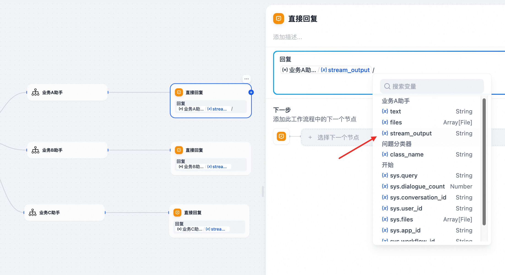
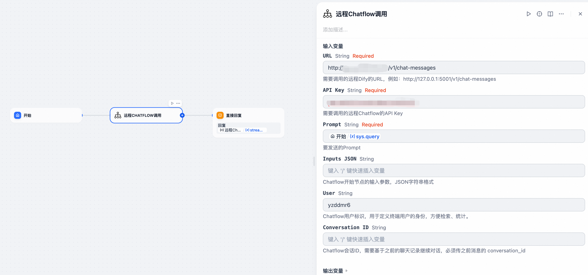

## Chatflow Invoker

**Author:** yzddmr6

**Version:** 0.0.6

**Type:** tool

**Repository:** https://github.com/yzddmr6/chatflow_invoker

### 更新日志

#### v0.0.6

* 解决重复输出问题：增加非流式输出字段在老版本dify上会导致重复输出问题，为了兼容性移除。
* 修改字段类型：输入字段从form格式改为llm格式，方便排查问题
* 修改日志打印方式为标准日志输出
* 修改user参数类型默认为必填

#### v0.0.4

* 支持节点报错信息回显，方便定位问题
* 支持非流式方式输出，可以通过stream_output来获取流式输出结果，text字段获取非流式输出结果
* 修复Conversation ID的维护逻辑，支持多轮会话的记忆功能
* 新增Universal Chatflow Invoker工具，支持任意流式接口的Agent调用


#### v0.0.3

* 更新dify_plugin依赖版本

#### v0.0.2

* 增加远程Chatflow调用
* 增加Conversation ID参数

#### v0.0.1

* 支持本地跨Chatflow调用


### 背景

当前Dify并不支持多Chatflow编排和跨Chatflow的调用。这意味着所有业务逻辑都必须在一个Chatflow画布中完成，当场景变得复杂时，画布将变得难以维护。

尽管Dify提供了将Chatflow转换为Workflow，并发布为Tool节点这种变通的调用方案，但这种方法存在以下限制：

* **无法实现流式输出**：Workflow作为Tool节点调用时，不支持Chatflow原有的流式输出能力，影响用户体验。
* **无法实现多个输出节点**：Workflow不像Chatflow那样支持多输出节点，进一步限制了复杂业务场景下的数据处理和展示。


因此我开发了一款插件：Chatflow Invoker，可以解决Dify在多Chatflow编排上的限制，让应用开发更加灵活和高效。


### 描述

Chatflow Invoker可以将Chatflow转换为流程编排中的节点，实现跨Chatflow调用。

它可以帮助您：

* **实现Chatflow的模块化**：将复杂业务逻辑拆分为多个独立的Chatflow，提高代码复用性和可维护性。
* **支持跨Chatflow调用**：在不同的Chatflow之间无缝调用，实现更灵活的业务流程编排。
* **保持流式输出体验**：确保在多Chatflow调用场景下依然能够享受Dify原有的流式输出能力。


### 本地Chatflow调用

通过Dify提供的反向调用接口，反向调用当前Dify实例下其他的Chatflow。


参数说明：

* APP ID（必选）：需要调用的Chatflow的APP ID，可以从Dify的Chatflow页面URL中获取。
* Prompt（必选）：要发送的Prompt。
* Inputs JSON（可选）：Chatflow开始节点的输入参数，JSON字符串格式。
* Keep Conversation（必选，默认为True）：是否保持会话上下文，以支持记忆功能。


### 远程Chatflow调用

为了进一步扩大Dify的灵活性，本插件还支持了远程Chatflow调用。不再局限于单个Dify实例，可以让你根据业务需要来自由组合，实现分布式调用。


参数说明：

* URL（必选）：需要调用的远程Dify的URL，例如：http://127.0.0.1/v1/chat-messages
* API Key（必选）：需要调用的远程Chatflow的API Key，第一次需要从侧边栏 访问API 中生成一个。
* Prompt（必选）：要发送的Prompt。
* Inputs JSON（可选）：Chatflow开始节点的输入参数，JSON字符串格式。
* User（必选）：Chatflow用户标识，用于定义终端用户的身份，方便检索、统计。
* Keep Conversation（必选，默认为True）：是否保持会话上下文，以支持记忆功能。


### 通用Chatflow调用

在大型复杂项目中，部分Agent可能是在 LangChain、LangGraph、OpenAI、百炼（Bailian）等不同平台开发的，怎么才能在dify实现统一的管理和调用呢？

如果不需要流式输出的话，虽然可以通过HTTP调用或将Agent发布为MCP工具来实现，但会牺牲流式输出，影响用户体验。

因此我实现了一个通用的流式接口调用工具，无论是模型、Agent、Workflow 还是 Chatflow，无论它诞生于哪个平台，使用何种 SDK，只需提供一个流式输出接口，它就能轻松接入 Dify，同时**完美保留流式输出能力**。告别体验断层，让你的 Dify 应用更加强大和流畅。


参数说明：

* URL（必选）：需要调用的远程Chatflow的URL，例如:http://localhost/v1/chat/completions
* Header JSON（可选）：请求的Header信息，JSON字符串格式，例如 {"Authorization": "xxxx"}
* Body JSON（可选）：请求的Body信息，JSON字符串格式，例如 {"model": "qwen-max", "messages": [{"role": "user", "content": "{{#sys.query#}}"}], "temperature": 0.7, "stream": true}
* JSON Path（必选）：从响应中提取返回内容的JSON Path，参考jsonpath_ng库的语法。例如OpenAI类接口为：$.choices[0].delta.content；百炼工作流应用为：$.output.workflow_message.message.content


### 用法示例

#### 调用本地Dify的Chatflow

打开待调用Chatflow的URL，从中获取APP ID

例如：https://dify/app/f011f58c-b1ce-4a9b-89b2-f39fce8466a8/workflow

这里的 `f011f58c-b1ce-4a9b-89b2-f39fce8466a8` 就是APP ID

Inputs JSON这里设置为需要收到一个user的参数。


在回复节点这里，需要选择stream_output来获取流式输出结果



测试执行，成功调用其他Chatflow，并且支持流式输出。


#### 通过API调用远程Dify的Chatflow

填入要调用的URL，以及API Key实现远程Dify的调用



#### 保持会话记忆

搞一个简单的测试（注意要在被调用的Chatflow中开启记忆功能）

把Keep Conversation这里设置为True，然后进行多次会话


从第二次的返回中可以看到Chatflow已经实现了上下文对话记忆的功能。


#### Dify调用OpenAI输出格式的Agent

我模拟了一个用LangGraph开发的Agent，让Cursor帮我实现了一个OpenAI格式的接口。

将Agent的API地址填入，这里没有设置鉴权逻辑也不用修改，保存并执行。


可以看到已经成功调用了LangGraph的Agent，并且支持流式输出。


#### Dify调用百炼的Agent

以百炼为例，展示一下如何对接一种新输出格式的Agent

在百炼上开发了一个简单的应用，除了query，还接收一个name参数。


根据百炼的文档，我们找到**流式输出**的curl命令：https://help.aliyun.com/zh/model-studio/invoke-workflow-application

```plain
curl --location 'https://dashscope.aliyuncs.com/api/v1/apps/YOUR_APP_ID/completion' \
--header 'X-DashScope-SSE: enable' \
--header 'Content-Type: application/json' \
--header 'Authorization: Bearer $DASHSCOPE_API_KEY' \
--data '{
    "input": {
        "prompt": "你是谁？"
    },
    "parameters":  {
        "flow_stream_mode": "message_format"
    },
    "debug": {}
}'
```

构造对应的调用参数：

```plain
https://dashscope.aliyuncs.com/api/v1/apps/xxx/completion
{
    "Authorization": "Bearer sk-xxx",
    "X-DashScope-SSE": "enable"
}
{
    "input": {
        "prompt": "{{#sys.query#}}",
        "biz_params": {"name": "yzddmr6"}
    },
    "parameters": {
        "flow_stream_mode": "message_format"
    },
    "debug": {}
}
```

以及获取对应的响应示例，编写对应的的Json Path

```plain
id:1
event:result
:HTTP_STATUS/200
data:{"output":{"session_id":"0a6aff53d8e945e4900452f04d55499b","workflow_message":{"node_status":"executing","node_type":"End","node_msg_seq_id":1,"node_name":"结束","message":{"content":"我是通义千问","role":"assistant"},"node_is_completed":false,"node_id":"End_7w1V"},"finish_reason":"null"},"usage":{},"request_id":"88878d48-097f-99c3-b6b9-b76f7366da90"}
```


成功调用百炼应用并实现流式输出。
